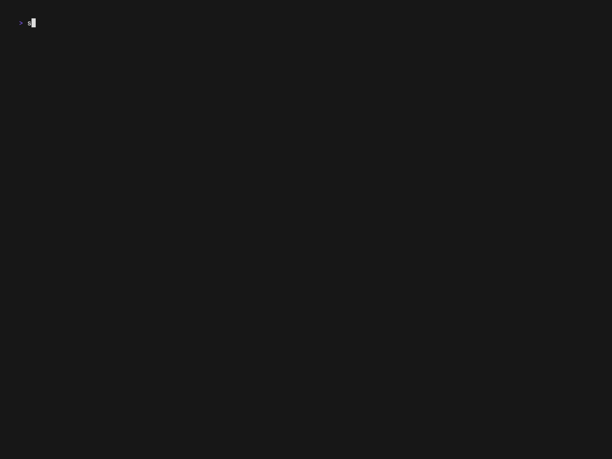

# spelchek.rs
This is a very small and simple spellchecker program I'm building in Rust using [ratatui](https://ratatui.rs/), with the goal of learning [ratatui](https://ratatui.rs/) and also having fun with some algorithms.

# Dictionary
The included dictionary (or rather list of words in the English language) is one from [wordlist.aspell.net](http://wordlist.aspell.net/). It should be copied to `$HOME/.spelchek/dict.txt` in order for the program to recognise it (this can be done by running  `make dict`).
